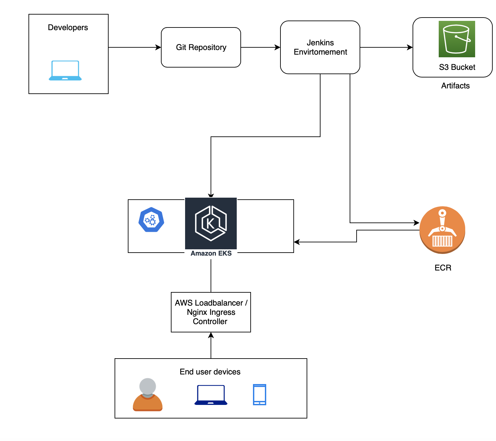

# Architecture

This library consists of Terraform `Infrastructure as code`  and Helm charts for `configuration as code`. This library deploys EKS cluster and underlying infrastructure and deploys Jenkins for CICD, Nexus for artifacts , docker registry and Grafana for monitoring.

# Installation Steps
## Requirements
```
Terraform v0.12.3
Helm v2.14.2
```

Create env.tfvar file with the values of your choice refer to templates/sample.tfvar  only value of `ssh-key-name` must be set to your own ssh key name rest all can be default setting.

Init the terraform

```terraform init```

Apply the terraform

```terraform apply --var-file=<path-toy-your-tfvars>```

To destroy the environment helm delete all charts first then destroy terraform

```terraform destroy --var-file=<path-toy-your-tfvars>```

## Jenkins configuration

Jenkins will be configured using helm chart stable/jenkins as `configuration as a code ` this can be viewed/ modified on `helm-config/jenkins-values.yaml`

## Nexus and Grafana

Nexus and Grafana will be deployed using helm chart please refer to config files under `helm-config/`

# Architecture

Continuous deployment to EKS using Jenkins

Terraform code will build EKS infrastrcutre
